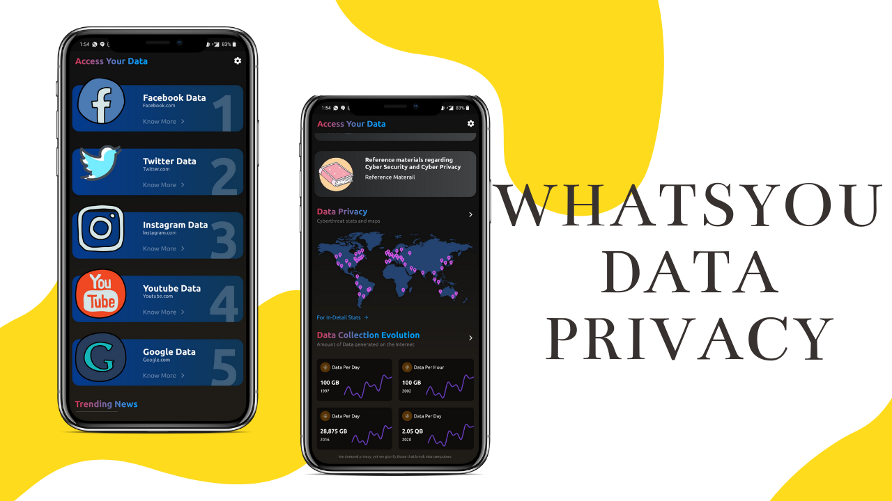
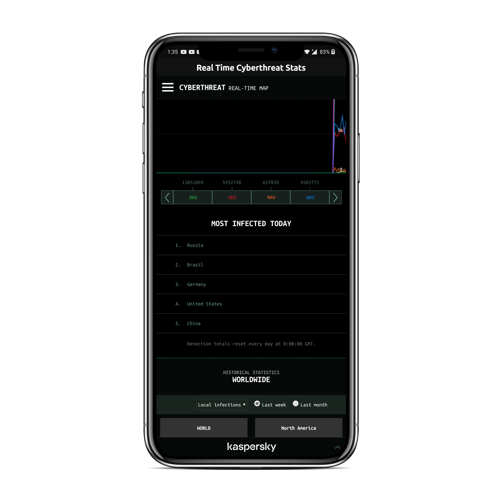
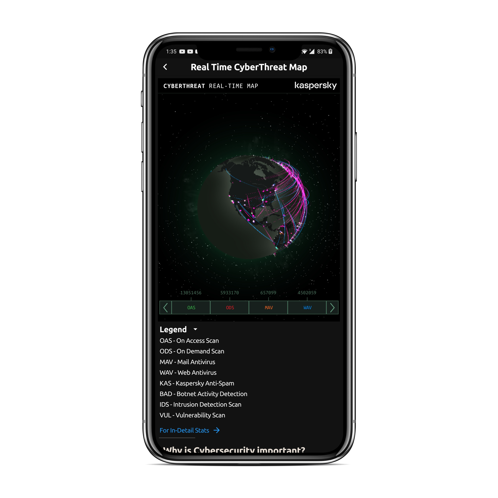
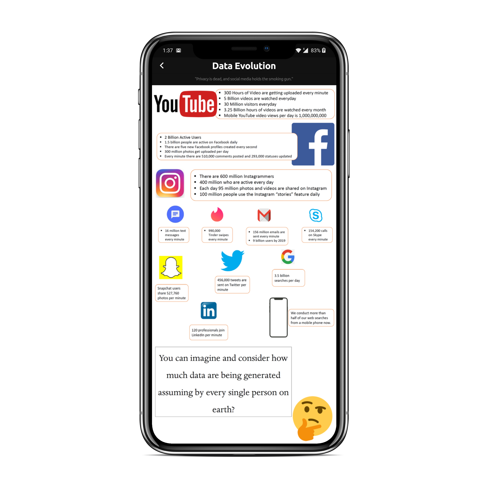
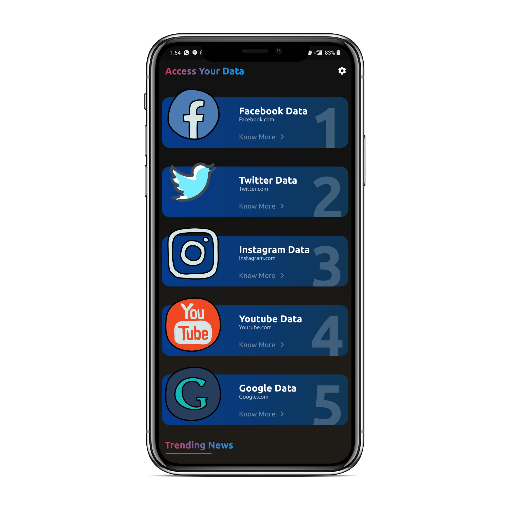
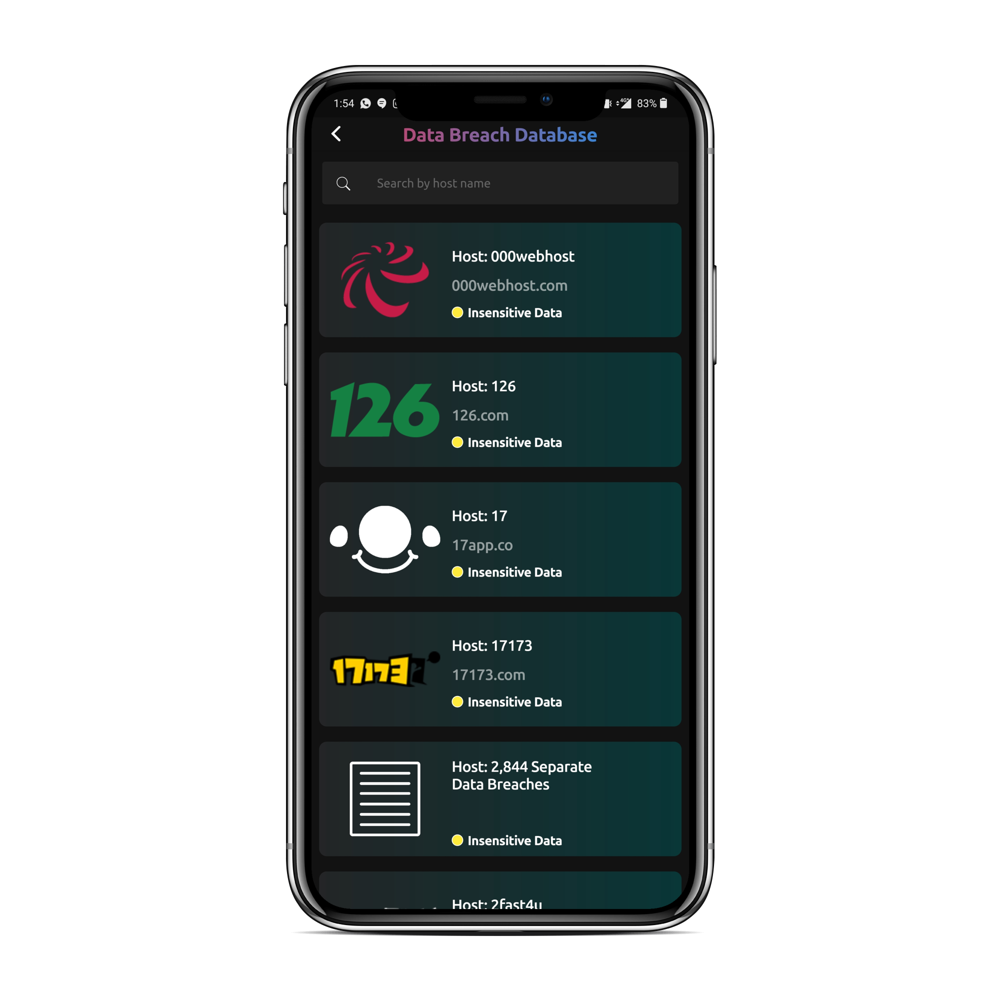
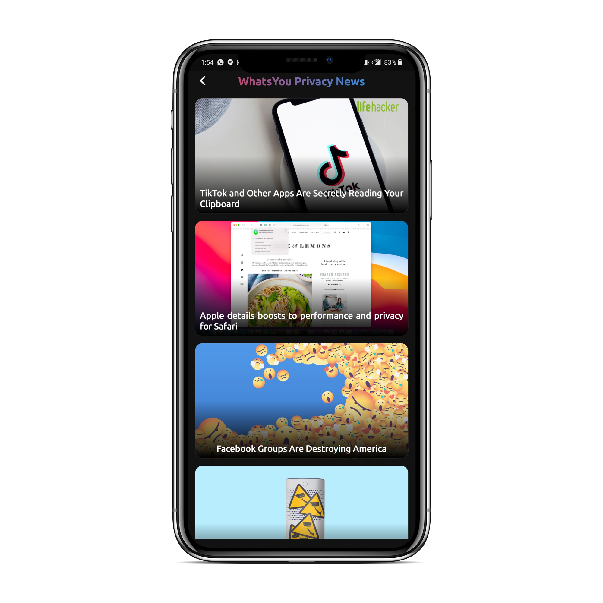
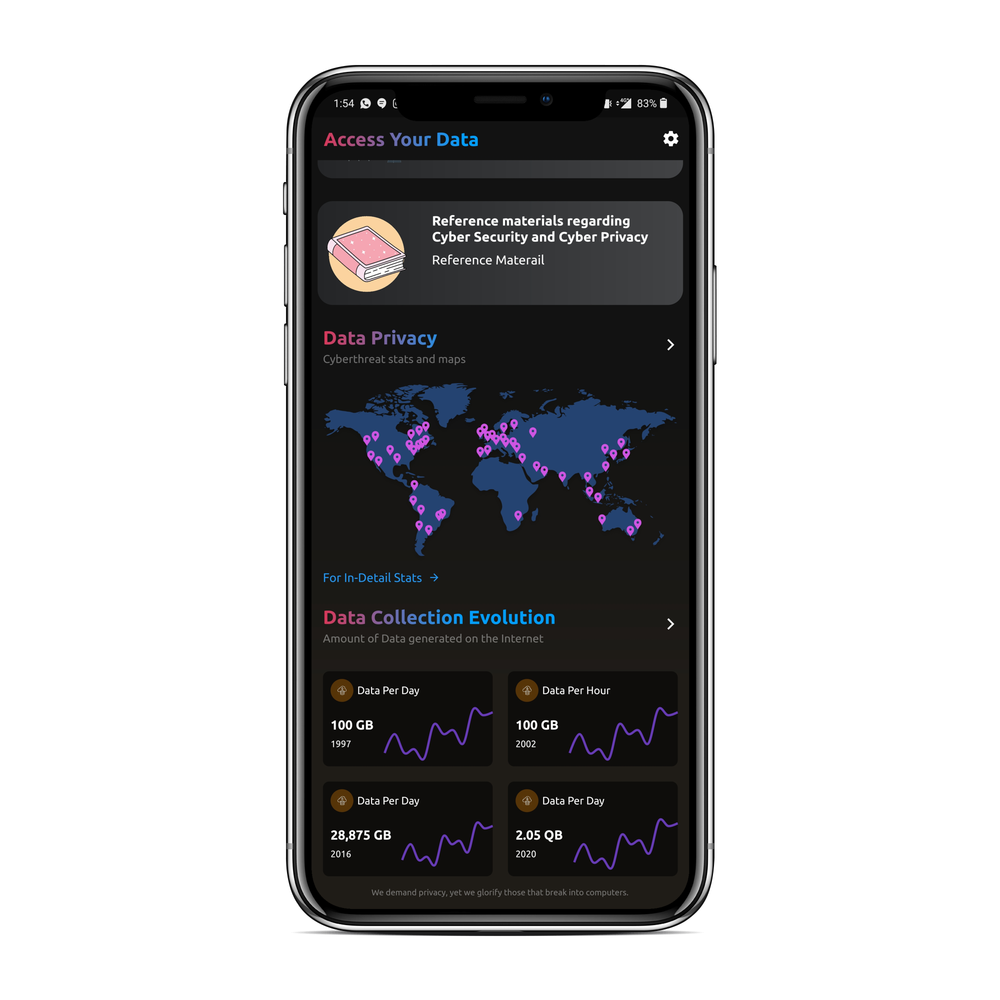
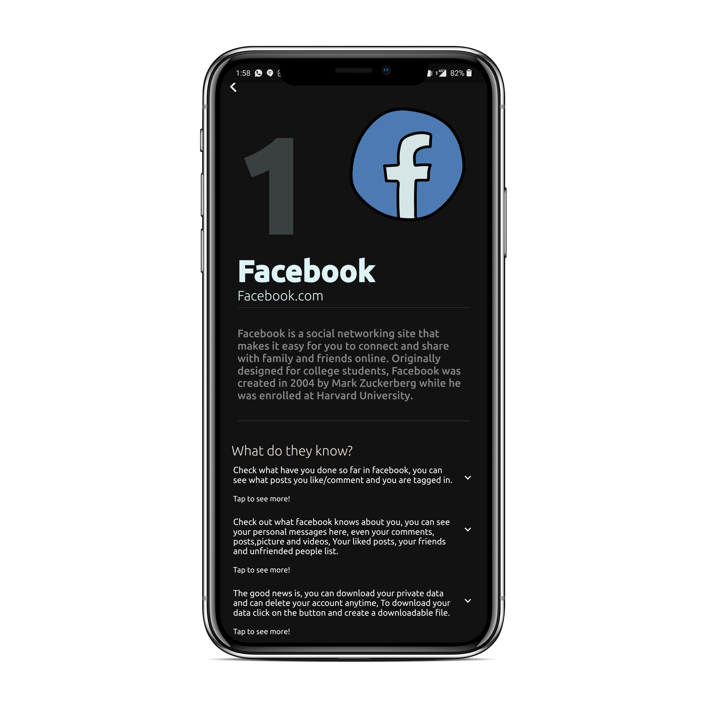
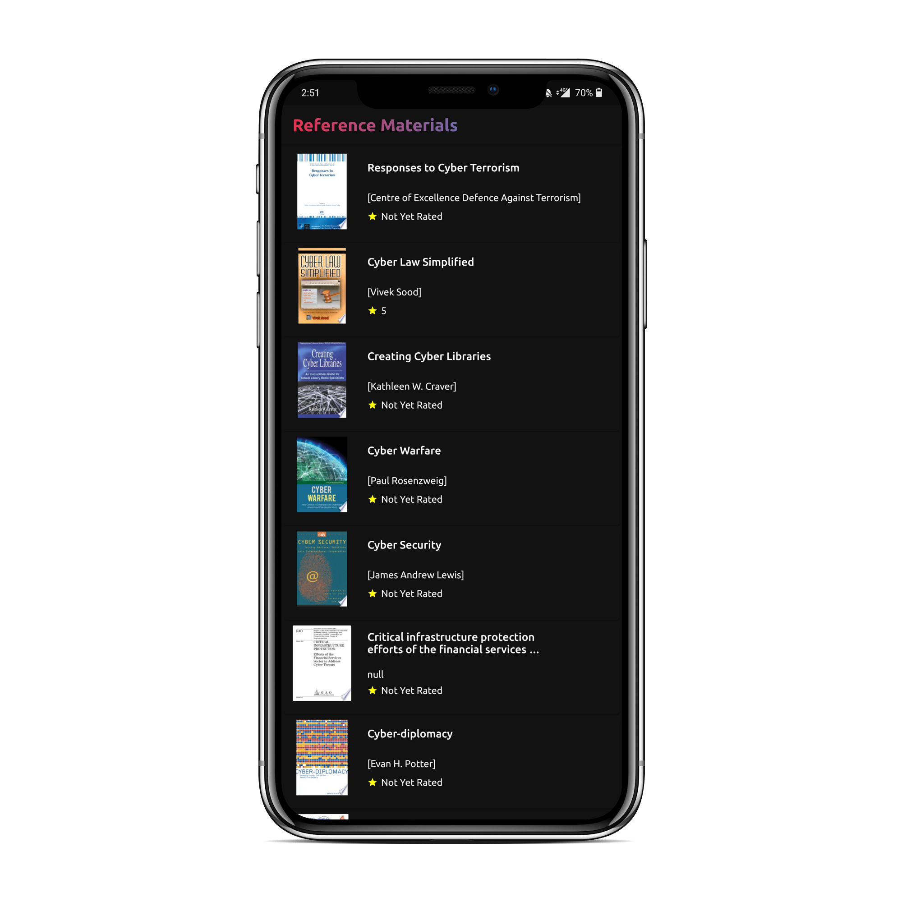

[](https://codemagic.io/apps/5f085eb95b00866571cf7cb5/5f085eb95b00866571cf7cb4/latest_build) 

<h1 align="center">
  <br>
  <a href="https://github.com/xanf-code/whats_you"></a>
  <br>
  WhatsYou Data Privacy App
  <br>
</h1>



WhatsYou is a all in one Data Privacy and Education App which allows you to see all of your Private data that is available Online to the Public.
Watch Demo Video on Youtube : (https://youtu.be/VxLxu1kqZMg)

Data Privacy and Cyber Security Awareness App made in 2020 Kaspersky Hackathon(Secur'IT Cup) using Kaspersky Widgets and HBP APIs to display Cyber Threat Awareness :fire:

## Playstore: (Releasing Soon...)

<a href='https://play.google.com/store/apps/details?id=com.you.whats_you'></a>

## Main Features

- ### Know what the internet knows about you!
- ### A lot of animations..A LOT!
- ### Real time Website Breach data
- ### Cupertino Model :heart:

## Demo


## How To Use

To clone and run this application, you'll need [Git](https://git-scm.com) and [Flutter](https://flutter.dev) on your computer. 

Then you'll need to get a free API key from [NewsAPI](https://newsapi.org) and specify it in the place of $NewsApi.

Similarly you'll need to get a free Project ID and Secret Key at [WireDash](https://wiredash.io/) and replace projectId: "" and secret: "" in main.dart file 
   
From your terminal:

```bash
# Clone this repository
$ git clone https://github.com/xanf-code/whats_you

# Go into the repository
$ cd whats_you
```
Then
```bash
# Run the app
$ flutter run
```

## Checklist: 

- [x] News Article Implementation
- [x] Main Page snapping fix
- [x] Back button news
- [x] Privacy to Data Privacy
- [ ] IP lookup API(Feature) -> Future
- [x] Breach Reports
- [x] Back Button Breach Page
- [x] Breach Database page Search Box 
- [x] Clickable hyperlinks
- [x] Detail Screen UI
- [x] About page
- [x] WireDash Feedback Implementation
- [x] Splash Screen
- [x] Cyber Security/Data books(Google Books API)
- [ ] Push Notification implementation
- [x] Implement Splash Screen

## Push Notification (Optional)

This project uses firebase messenging for push notification.

To integrate push notification from firebase follow the steps:
- Go to firebase console
- Generate and Download **google-services.json** file
- Place **google-services.json** file inside android/app
- It should be ready now. Test your push notification.

For further instruction read documentation from https://pub.dev/packages/firebase_messaging

# Screenshots

|   |   |   |
||||
||||
||||

# LICENCE

Released under the [MIT](./LICENSE) License.<br>


